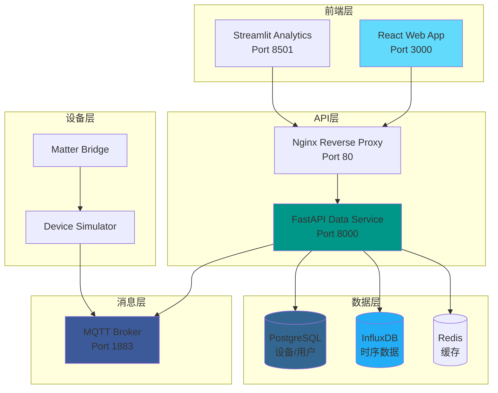
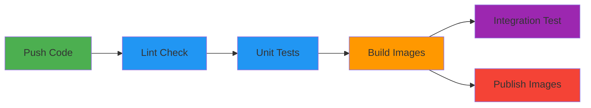

<div align="center"  \"center\"  \  \\"center\"  \  \\"center\">

# ⚡ Smart Energy Platform  ⚡ 智能能源管理平台
# ⚡ 智能能源平台
# ⚡ 智能能源平台

**智能能源能耗管理平台 - 集成IoT设备模拟、数据分析与可视化的综合解决方案**

[](https://github.com/YOUR_USERNAME/smart-energy-platform/actions/workflows/ci.yml)
[](https://opensource.org/licenses/MIT)
[](https://www.python.org/downloads/)
[](https://fastapi.tiangolo.com/)
[](https://react.dev/)

</div>

---

## 🚀 快速开始

### 方式一：Docker 一键启动（推荐）

```bash
# 1. 克隆项目
git clone https://github.com/YOUR_USERNAME/smart-energy-platform.git
cd smart-energy-platform

# 2. 启动基础服务（PostgreSQL + InfluxDB + MQTT + Redis）
docker-compose -f docker-compose.dev.yml up -d

# 3. 安装后端依赖并启动
cd data_service
pip install -r requirements.txt
cp .env.example .env  # 编辑 .env 配置数据库连接
python main.py

# 4. 新终端 - 启动前端
cd web_app
npm install
npm run dev
```

### 方式二：本地运行（无需 Docker）

```bash
# 1. 克隆项目
git clone https://github.com/YOUR_USERNAME/smart-energy-platform.git
cd smart-energy-platform/data_service

# 2. 安装依赖
pip install -r requirements.txt

# 3. 创建 .env 文件（使用 SQLite）
echo DATABASE_URL=sqlite+aiosqlite:///./smart_energy.db > .env

# 4. 启动后端
python main.py

# 5. 新终端 - 启动前端
cd ../web_app
npm install
npm run dev
```

### 访问地址

| 服务 | 地址 | 说明 |
|------|------|------|
| 🌐 前端页面 | http://localhost:5173 | React 仪表盘 |
| 📡 API 文档 | http://localhost:8000/docs | Swagger UI |
| 📊 数据分析 | http://localhost:8501 | Streamlit 分析工具 |
| 🗄️ InfluxDB | http://localhost:8086 | 时序数据库 UI |

---

## 📸 页面预览

> 💡 点击下方链接查看交互式页面预览（纯前端演示，无需启动后端）

| 页面 | 预览链接 | 说明 |
|------|----------|------|
| 📊 仪表盘 | [dashboard.html](docs/previews/dashboard.html) | 总览：统计数据 + 能耗曲线 + 设备分布 |
| 📱 设备列表 | [device-list.html](docs/previews/device-list.html) | 所有设备卡片视图，支持搜索筛选 |
| 🔌 设备详情 | [device-detail.html](docs/previews/device-detail.html) | 单设备实时数据 + 历史趋势 |
| 📈 数据分析 | [analytics.html](docs/previews/analytics.html) | 多维统计 + 异常检测 + 告警记录 |

---

## 📖 项目简介

Smart Energy Platform 是一个全栈智能能源管理系统，用于监控、分析和优化家庭或商业建筑的能源消耗。项目采用微服务架构，集成了IoT设备模拟、实时数据采集、高级数据分析和直观的可视化界面。

### 🎯 核心价值

- **实时监控** - 实时追踪所有智能设备的能耗数据
- **智能分析** - 基于机器学习的能耗预测和异常检测
- **可视化** - 丰富的图表和仪表盘，直观展示能源使用情况
- **可扩展** - 支持动态添加设备类型，无需修改代码
- **标准兼容** - 模拟Matter协议集成，展示IoT标准理解

---

## 🏗️ 系统架构



---

## 🛠️ 技术栈

### 后端

| 技术 | 版本 | 用途 | 选型理由 |
|------|------|------|----------|
| **FastAPI** | 0.109 | Web框架 | 高性能异步框架，自动生成OpenAPI文档 |
| **SQLAlchemy** | 2.0 | ORM | 异步支持强大，生态成熟 |
| **PostgreSQL** | 15 | 关系数据库 | 稳定可靠，JSON支持优秀 |
| **InfluxDB** | 2.7 | 时序数据库 | 专为时序数据优化，查询高效 |
| **Paho MQTT** | 1.6 | MQTT客户端 | Python MQTT标准库 |
| **Pandas** | 2.1 | 数据处理 | 数据分析必备库 |
| **Scikit-learn** | 1.3 | 机器学习 | 简单易用的ML库 |

### 前端

| 技术 | 版本 | 用途 | 选型理由 |
|------|------|------|----------|
| **React** | 18 | UI框架 | 组件化开发，生态丰富 |
| **TypeScript** | 5 | 类型安全 | 提高代码质量和开发效率 |
| **Vite** | 5 | 构建工具 | 极速热更新，构建快速 |
| **Ant Design** | 5 | UI组件库 | 企业级组件，开箱即用 |
| **ECharts** | 5 | 图表库 | 功能强大，中文友好 |
| **Axios** | 1.6 | HTTP客户端 | 拦截器支持，错误处理完善 |

### 数据分析

| 技术 | 版本 | 用途 | 选型理由 |
|------|------|------|----------|
| **Streamlit** | 1.29 | 分析界面 | 快速构建数据应用 |
| **Plotly** | 5.18 | 交互式图表 | 美观且交互性强 |

### 基础设施

| 技术 | 用途 | 选型理由 |
|------|------|----------|
| **Docker** | 容器化 | 环境一致性 |
| **Nginx** | 反向代理 | 高性能，配置灵活 |
| **GitHub Actions** | CI/CD | 与GitHub深度集成 |

---

## ✨ 功能特性

### 📊 数据采集与存储

- **MQTT消息订阅** - 自动接收设备上报的能耗数据
- **双数据库存储** - PostgreSQL存储元数据，InfluxDB存储时序数据
- **批量数据处理** - 支持批量创建读数，提高吞吐量
- **自动设备注册** - 首次上报数据时自动创建设备记录

### 📈 数据分析与可视化

- **实时监控仪表盘** - 展示全屋总能耗、设备状态
- **多维度统计** - 按小时、天、周粒度聚合分析
- **异常检测** - 基于Z-score的能耗异常识别
- **异常检测** - 基于 Z-score 的能耗异常识别
- **异常检测** - 基于 Z-score 的能耗异常识别
- **异常检测** - 基于 Z-score 的能耗异常识别
- **负荷分析** - 24小时负荷曲线、用电高峰识别
- **负荷分析** - 24 小时负荷曲线、用电高峰识别
- **负荷分析** - 24 小时负荷曲线、用电高峰识别
- **负荷分析** - 24小时负荷曲线、用电高峰识别
- **负荷分析** - 24 小时负荷曲线、用电高峰识别
- **负荷分析** - 24小时负荷曲线、用电高峰识别
- **负荷分析** - 24小时负荷曲线、用电高峰识别
- **负荷分析** - 24 小时负荷曲线、用电高峰识别
- **负荷分析** - 24小时负荷曲线、用电高峰识别
- **预测模型** - 基于线性回归的能耗预测

### 🔌 设备管理

- **动态设备类型** - 支持运行时添加新设备类型
- **设备控制** - 远程控制智能插座开关
- **状态追踪** - 实时监控设备在线状态
- **Matter协议集成** - 模拟Matter桥接设备

### 🔒 工程化实践

- **完整测试** - 单元测试、集成测试覆盖
- **CI/CD流水线** - 自动化代码检查、测试、构建
- **容器化部署** - Docker一键启动
- **API文档** - 自动生成的Swagger/ReDoc文档

---


## 📁 项目结构

```
smart-energy-platform/  智能能源平台/  智能能源平台/  智能能源平台/
├── .github/workflows/          # GitHub Actions CI/CD
│   └── ci.yml
├── data_service/               # FastAPI数据服务
│   ├── app/
│   │   ├── api/               # API路由
│   │   ├── core/              # 核心配置
│   │   ├── models/            # 数据模型
│   │   ├── schemas/           # Pydantic模型
│   │   └── services/          # 业务服务
│   ├── tests/                 # 单元测试
│   ├── main.py                # 应用入口
│   └── requirements.txt
├── analyst_tool/              # Streamlit分析工具
│   ├── app.py                 # 主应用
│   ├── .streamlit/            # Streamlit配置
│   └── requirements.txt
├── web_app/                   # React前端
│   ├── src/
│   │   ├── components/        # React组件
│   │   ├── pages/             # 页面组件
│   │   ├── services/          # API服务
│   │   └── types/             # TypeScript类型
│   ├── package.json
│   └── vite.config.ts
├── device_simulator/          # 设备模拟器
│   ├── simulator.py           # 模拟器主程序
│   └── matter_bridge.py       # Matter桥接模块
├── config/                    # 配置文件
│   ├── mosquitto/             # MQTT配置
│   └── nginx/                 # Nginx配置
├── scripts/                   # 脚本工具
│   └── test_integration.sh
├── docker-compose.yml         # Docker编排
├── docker-compose.dev.yml     # 开发环境
└── README.md
```

---

## 📡 API文档

### 主要端点

#### 能耗数据

```http
POST   /api/readings              # 创建单条读数
POST   /api/readings/batch        # 批量创建读数
GET    /api/readings              # 查询读数列表
GET    /api/readings/device/{id}/summary  # 获取设备汇总
```

#### 设备管理

```http
GET    /api/devices               # 获取设备列表
GET    /api/devices/{id}          # 获取设备详情
GET    /api/devices/{id}/readings # 获取设备读数
GET    /api/devices/{id}/readings/hourly  # 小时统计
GET    /api/devices/{id}/readings/daily   # 日统计
```

#### 设备类型

```http
GET    /api/device-types          # 获取所有设备类型
POST   /api/device-types          # 创建设备类型
PUT    /api/device-types/{key}    # 更新设备类型
POST   /api/device-types/init-defaults  # 初始化默认类型
```

### 请求示例

```bash
# 创建能耗读数
curl -X POST http://localhost:8000/api/readings \
  -H "Content-Type: application/json" \
  -d '{
    "device_id": "smart_meter_001",
    "power_watts": 1500.5,
    "energy_kwh": 45.2,
    "voltage": 220.0,
    "current_amps": 6.82
  }'

# 获取设备列表
curl http://localhost:8000/api/devices

# 获取设备读数（带时间范围）
curl "http://localhost:8000/api/devices/smart_meter_001/readings?hours=24&limit=100"
```

---

## 🔌 Matter协议集成

### 什么是Matter？

Matter（原名CHIP）是由CSA联盟开发的统一智能家居标准，旨在解决设备互操作性问题。

### 核心特性

- **基于IP协议** - 使用Wi-Fi、Thread、以太网
- **基于 IP 协议** - 使用 Wi-Fi、Thread、以太网
- **统一设备模型** - 标准设备类型和集群定义
- **本地优先** - 减少对云服务的依赖
- **安全通信** - 证书和加密机制

### 本项目的实现

在`device_simulator/matter_bridge.py`中：

```python
# Matter设备类型映射
MATTER_DEVICE_TYPES = {
    "smart_meter": (0x000D, "Energy Meter"),
    "solar_panel": (0x0510, "Electrical Sensor"),
    "ev_charger": (0x010A, "On/Off Plug-in Unit"),
    "hvac": (0x0301, "Thermostat")
}

# 模拟Matter桥接器
class MatterBridgeDevice:  类 MatterBridgeDevice：
    def add_bridged_device(self, device_id, device_type, name):
        # 将设备添加到Matter网络
        ...

    def update_device_state(self, endpoint_id, reading):
        # 更新设备状态属性
        ...
```

### 

> 模拟支持Matter协议的设备，并通过一个桥接服务将其接入平台。桥接器将非Matter设备（如智能电表、太阳能板）转换为Matter端点，使其能够参与Matter网络通信。提现IoT协议栈和设备互操作性的理解。"


---

## 🧪 测试

### 运行单元测试

```bash
cd data_service
pip install -r requirements.txt
pytest tests/ -v
```

### 运行集成测试

```bash
chmod +x scripts/test_integration.sh
./scripts/test_integration.sh
```

### 测试覆盖率

```bash
pytest tests/ --cov=app --cov-report=html
# 打开 htmlcov/index.html 查看报告
```

---

## 🔄 CI/CD流水线

项目配置了完整的GitHub Actions流水线：



### 流水线阶段

1. **代码质量检查** - Black、Flake8、isort
2. **单元测试** - Pytest + 覆盖率报告
3. **构建镜像** - Docker多服务构建
4. **集成测试** - 端到端验证
5. **发布镜像** - 推送到GitHub Container Registry

---

## 📈 性能优化

- **数据库索引** - 关键字段添加索引
- **API缓存** - 使用fastapi-cache2缓存频繁查询
- **异步处理** - 全链路异步支持
- **连接池** - 数据库连接池复用
- **批量操作** - 支持批量数据写入

---

## 🤝 贡献指南

1. Fork 项目
2. 创建特性分支 (`git checkout -b feature/AmazingFeature`)
3. 提交更改 (`git commit -m 'Add some AmazingFeature'`)
4. 推送到分支 (`git push origin feature/AmazingFeature`)
5. 创建 Pull Request

---

## 📝 许可证

本项目采用 MIT 许可证 - 查看 [LICENSE](LICENSE) 文件了解详情

---

## 👏 致谢

- [FastAPI](https://fastapi.tiangolo.com/) - 优秀的Python Web框架
- [React](https://react.dev/) - 强大的前端UI库
- [Streamlit](https://streamlit.io/) - 快速构建数据应用
- [Ant Design](https://ant.design/) - 企业级UI组件库
- [ECharts](https://echarts.apache.org/) - 强大的图表库

---

<div align="center">

**⚡ Built with ❤️ by Smart Energy Platform Team**

</div>
